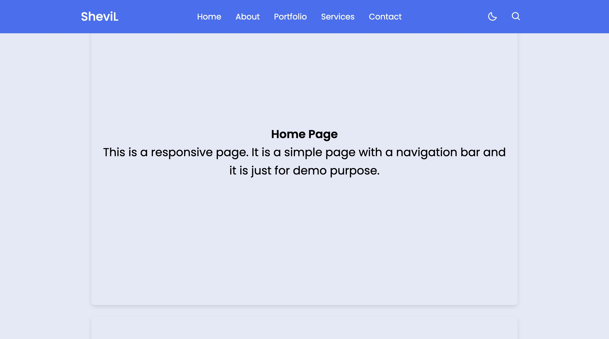

# Demo Website

This is a simple demo website showcasing a responsive design with a navigation bar and multiple content sections. It includes functionality for dark mode toggle and a search box.

## Features

-   Responsive navigation bar with menu toggle for smaller screens.
-   Dark mode toggle that persists using local storage.
-   Smooth scrolling to different sections of the page.
-   Simple search box functionality (UI only).

## Technologies Used

-   HTML
-   CSS
-   JavaScript

## Setup

1. Clone the repository:

    ```bash
    git clone https://github.com/Shevilll/Prasunet_WD_01.git
    cd demo-website
    ```

2. Open `index.html` in your web browser to view the demo.

## Screenshots



## Contributing

Contributions are welcome! Feel free to fork the repository and submit pull requests.

## License

This project is licensed under the MIT License - see the [LICENSE](LICENSE) file for details.
