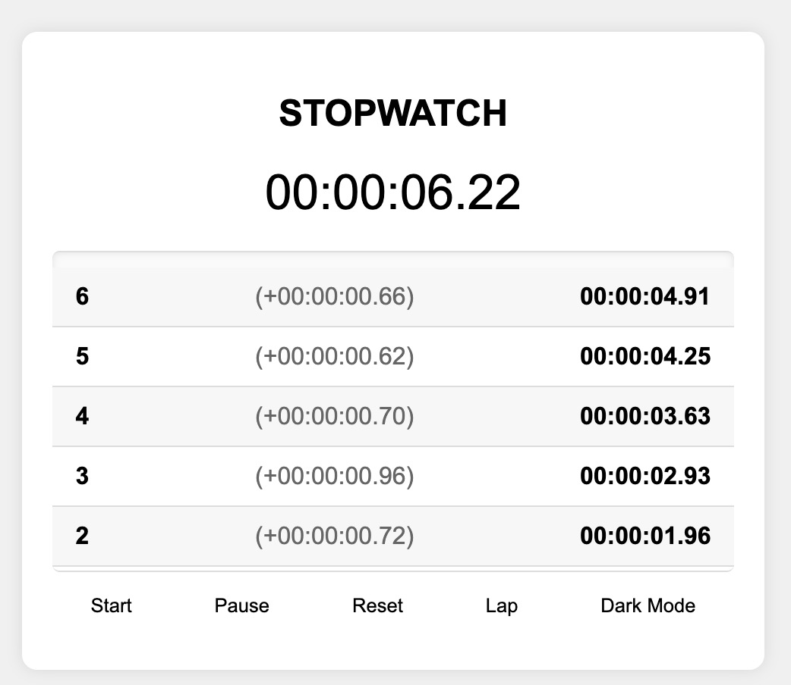
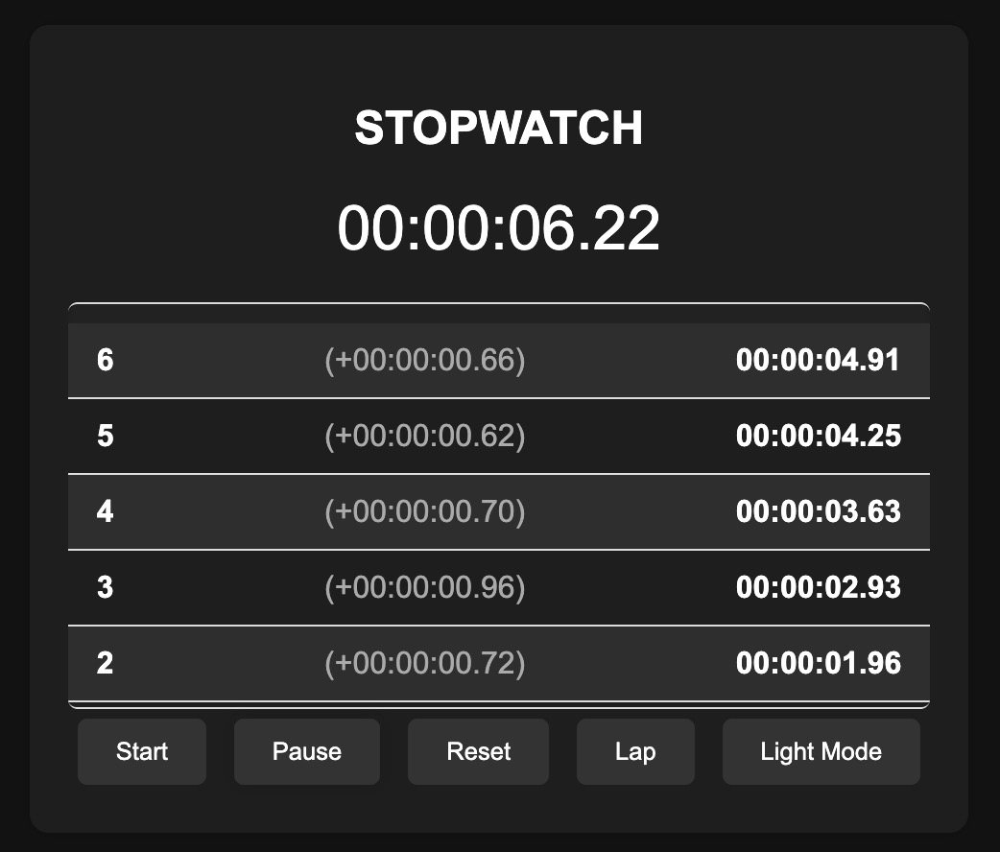

# Stopwatch Web Application

This is a simple stopwatch web application built using HTML, CSS, and JavaScript. It allows users to start, pause, reset the stopwatch, record laps, and switch between dark and light modes.



## Features

-   Start/Stop functionality
-   Lap recording
-   Reset stopwatch
-   Dark/Light mode toggle

## Technologies Used

-   HTML
-   CSS
-   JavaScript

## How to Use

1. Clone the repository:

    ```bash
    git clone https://github.com/Shevilll/Prasunet_WD_02.git
    ```

2. Open `index.html` in your web browser.
3. Click the "Start" button to start the stopwatch.
4. Click the "Pause" button to pause the stopwatch.
5. Click the "Reset" button to reset the stopwatch.
6. Click the "Lap" button to record laps.
7. Click the "Dark Mode" button to toggle between dark and light modes.

## File Structure

-   `index.html`: Main HTML file containing the structure of the stopwatch.
-   `styles.css`: CSS file containing styles for the stopwatch and dark/light mode.
-   `script.js`: JavaScript file containing functionality for the stopwatch.

## Preview



## Author

-   [Ahmad Faraz](https://github.com/Shevilll)

## License

This project is licensed under the MIT License - see the [LICENSE](LICENSE) file for details.
