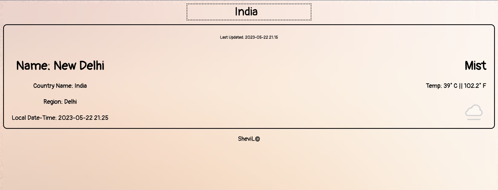
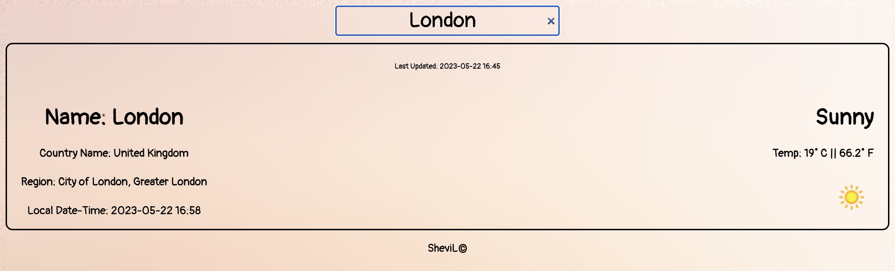

# SheviL Weather App

## Overview

**SheviL** is a simple weather application built using React, JavaScript, HTML, and CSS. It fetches weather data from the [WeatherAPI](https://www.weatherapi.com/) and displays it to the user.




## Features

-   Get current weather information for any city.
-   Display weather details including temperature, humidity, wind speed, and more.
-   User-friendly interface with responsive design.

## Getting Started

### Prerequisites

To run this project, you need to have Node.js and npm (Node Package Manager) installed on your system. If you don't have them installed, you can download and install them from [nodejs.org](https://nodejs.org/).

### Installation

1. Clone the repository:

    ```bash
    git clone https://github.com/Shevilll/Prasunet_WD_05.git
    cd shevil-weather-app
    ```

2. Install the dependencies:

    ```bash
    npm install
    ```

3. Create a `.env` file in the root directory of the project and add your WeatherAPI key:

    ```env
    REACT_APP_WEATHER_API_KEY=your_api_key_here
    ```

4. Start the development server:
    ```bash
    npm start
    ```

The application should now be running on `http://localhost:3000`.

## Usage

-   Enter the name of the city in the search bar to get the current weather details.
-   The weather data will be fetched and displayed on the screen.

## Technologies Used

-   **React**: JavaScript library for building user interfaces
-   **JavaScript**: Programming language for the web
-   **HTML**: Markup language for creating web pages
-   **CSS**: Style sheet language for designing web pages

## Screenshots


## Contributing

Contributions are welcome! Please open an issue or submit a pull request.

## License

This project is licensed under the MIT License.

## Acknowledgements

-   [WeatherAPI](https://www.weatherapi.com/) for providing the weather data.

## Contact

-   **Author**: Ahmad Faraz
-   **Email**: ahmadfaraz00710@gmail.com
